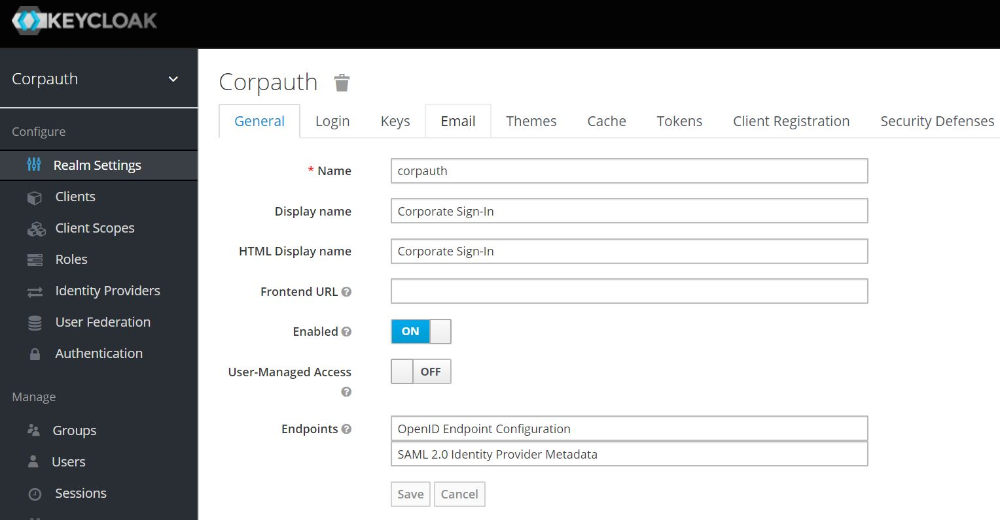
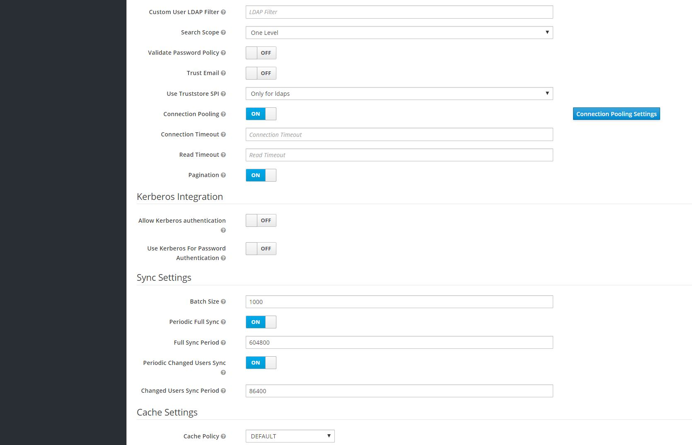
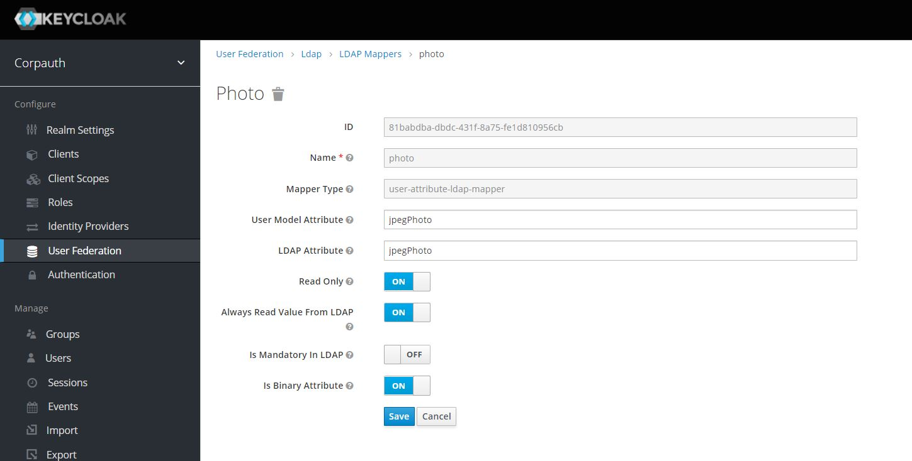
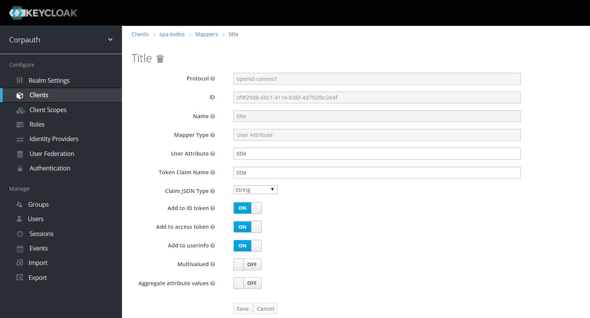

# Keycloak as Authorization Server
This project utilizes [Keycloak](https://www.keycloak.org/) as it is an [OpenID certified](https://openid.net/developers/certified/) identity provider.

If you have a Docker runtime installed, you can use following docker-compose file to quickly start a Keycloak server with admin portal run on <span>h</span>ttp://localhost:8080/auth/admin and an [OpenLDAP](https://www.openldap.org/) based directory server: 

```yml
version: '3'
services:
  keycloak:
    container_name: keycloak
    image: jboss/keycloak
    environment:
      - KEYCLOAK_USER=<KEYCLOAK_ADMIN_USER>
      - KEYCLOAK_PASSWORD=<KEYCLOAK_ADMIN_PASSWORD>
    ports:
      - "8080:8080"
  openldap:
    container_name: openldap
    image: osixia/openldap:1.3.0
    environment:
      - LDAP_ORGANISATION=The Corporation
      - LDAP_DOMAIN=corp.com
      - LDAP_ADMIN_PASSWORD=<OPENLDAP_ADMIN_PASSWORD>
    ports:
      - "389:389"
```
or choose another relevant [method](https://www.keycloak.org/docs/latest/server_installation/index.html#installation) for you.

The project uses a sample [user database](./ldap/conf/ldap_data.ldif) that can be imported as follows:
```bash
docker exec -it openldap ldapadd -x -D "cn=admin,dc=corp,dc=com" -w <OPENLDAP_ADMIN_PASSWORD> -f /home/ldap_data.ldif -ZZ
``` 
## Creating a new Realm

After starting Keycloak server you can launch to `<server.host>/auth/admin` and login to administration portal using admin username & password. Then you need to create a realm rather than top level "master" realm to manage users, credentials, roles, and groups.

To create a new realm use the drop-down menu next to the realm name in the upper-left corner:


For this project corpauth is the custom realm:


## Creating a client for SPA

To interact with IdP a client must be configured in Keycloak using `Clients` menu in left hand side then creating a client with Client Protocol set as openid-connect:


After saving, we can see all the configuration options of the client:
* `Valid Redirect URIs` should contain the address of SPA client.
* Make sure the Standard Flow is enabled and other flows are disabled to enable Authorization Code Flow. 
* `Access Type` should be `public` as SPAs are public clients.
* `Web Origins` should contain SPA root and resource server API endpoint root.


## Directory Server Integration

This project uses an LDAP server as user base and integration can be done via `User Federation` menu of Keycloak in left hand side then using `Add Provider --> ldap`. A sample configuration is as follows:




The sample configuration enables Keycloak to use OpenLDAP server as user base with a designated synchronization policy defined under `Sync Settings`. In order to perform a force synchronization `Synchronize all users` button under that page should be used. As sample LDAP user entities contains title and photo attributes LDAP mappers with the type of `user-attribute-ldap-mapper` should be set in Keycloak. The `Mappers` tab under the same page:




These mappings should also done for client created in order to retrieve these user attributes via `/userinfo` endpoint. This can be done under `Mappers` tab using `Create` button on relevant client definition page:  



## Roles

Roles and scopes are used to classify and control access to resources. Roles and scopes can be used by resource server to decide whether request to access a resource (API call) is authorized. For this project we only use LDAP based roles not scopes for authorization.

In order to use LDAP as a base for role definitions a new LDAP mapper with the type of `role-ldap-mapper` should be added under defined User Federation setting of LDAP. A sample configuration applies to our pre-defined user database is as follows:


